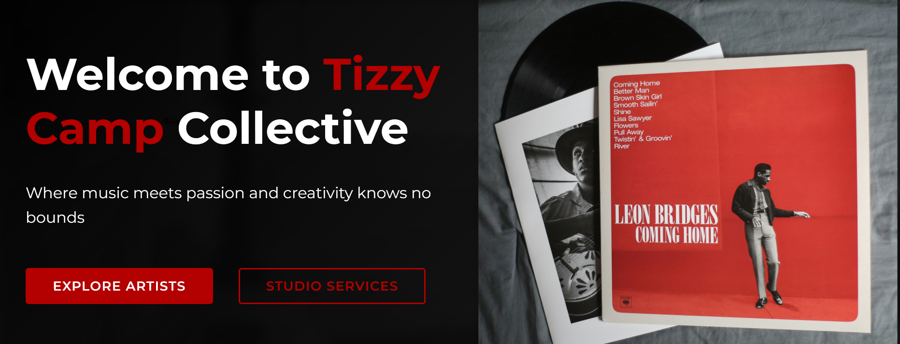

# Tizzy Camp Music Label & G.O.E Records



---

# Project Description

This Tizzy Camp Music Label & G.O.E Records project is a professional website showcasing a collective of talented artists and a state-of-the-art recording studio. The platform serves as a digital hub for the music label, featuring artist profiles, music releases, studio services, booking information, and company details.

Built as a modern single-page application using React, the website offers smooth navigation and responsive design to accommodate visitors across all device types. Key features include artist profiles with discographies, a beat store, studio gallery, booking system, and informational pages about the label.

---

## Technologies Used

- **Frontend**: React.js, React Router
- **Styling**: CSS with custom properties (CSS variables)
- **Icons**: React Icons (Font Awesome)
- **Build Tool**: Vite

---

## Features

- Responsive design for all screen sizes
- Smooth page transitions and scroll behaviors
- Artist profiles and discographies
- Studio services and booking information
- Music releases catalog
- Contact forms and company information
- Back-to-top and scroll restoration functionality

---

## Installation

To set up this project locally, follow these steps:

- **Clone the repository**:

```bash
git clone https://github.com/IamLRBA/tizzy-camp-music.git
cd tizzy-camp-music
```

- **Install dependencies**:

```bash
npm install
```

- **Start the development server**:

```bash
npm run dev
```

- Open your browser to http://localhost:3000 to view the application.

---

## Project Structure

src/
├── components/       # Reusable UI components
├── pages/            # Page components
├── routes/           # Application routing
├── styles/           # Global styles and CSS variables
├── App.jsx           # Main application component
└── main.jsx          # Application entry point

---

## Available Scripts

- **npm run dev**: Starts the development server
- **npm run build**: Builds the application for production
- **npm run lint**: Runs ESLint for code quality checking
- **npm run preview**: Previews the production build locally

---

## Deployment

The application is deployed using Vercel and is automatically deployed when changes are pushed to the main branch.

---

## Contributing

Contributions are welcome. Please open an issue to discuss proposed changes before submitting a pull request.

---

## License

This project is proprietary software owned by Tizzy Camp Music Label & G.O.E Records. All rights reserved.